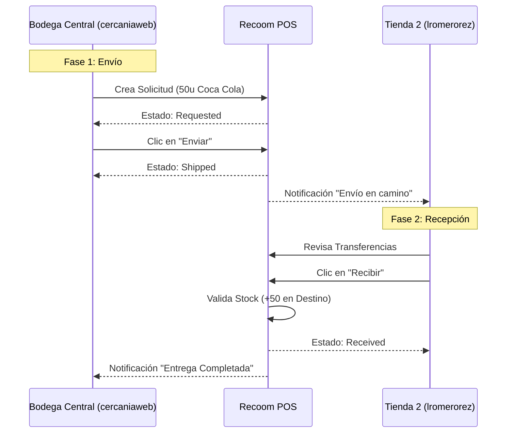

# 🔄 Guía de Transferencias entre Tiendas (Flujo 0 a 100)

Esta guía detalla el proceso completo de realizar una transferencia de inventario entre dos sucursales, utilizando dos cuentas de usuario para simular la operación real.

### Actores del Proceso
1.  **Tienda Origen (Solicitante)**: `cercaniaweb@gmail.com` (Ubicación: Bodega Central)
2.  **Tienda Destino (Receptor)**: `lromerorez@gmail.com` (Ubicación: Tienda 2)

---

## 🛠️ Fase 0: Configuración Previa

Antes de iniciar, aseguramos que el segundo usuario esté correctamente asignado a su tienda.

1.  Iniciar sesión con **Administrador** (`cercaniaweb@gmail.com`).
2.  Ir a **Usuarios** (`/users`).
3.  Verificar si `lromerorez@gmail.com` existe. Si no, hacer clic en "Añadir Usuario".
4.  **Crucial**: Asignar a `lromerorez@gmail.com` la tienda **"Tienda 2"** (o destino).
    *   *Nota: Si el usuario ya existe pero no tiene tienda, editarlo y asignarla.*

---

## 🚀 Fase 1: Creación de Solicitud (Origen)

**Usuario**: `cercaniaweb@gmail.com`

1.  Navegar a **Inventario > Transferencias** (`/inventory/transferencias`).
2.  En la sección "New Request":
    *   **Destination Store**: Seleccionar "Tienda 2" (donde está `lromerorez`).
    *   **Product**: Buscar "Coca Cola 600ml" (o cualquier producto con stock).
    *   **Quantity**: Ingresar `50`.
    *   Clic en **Add**.
3.  Revisar la lista de items y hacer clic en **Create Request**.

> **Estado del Sistema**: La transferencia se crea con estado `requested` (Solicitado).

4.  En "Transfer History", localizar la nueva transferencia.
5.  Hacer clic en el botón azul **Enviar** (Icono de camión 🚚).

> **Estado del Sistema**: La transferencia cambia a `shipped` (En Tránsito). El stock se descuenta temporalmente de la Bodega Central.

---

## 📥 Fase 2: Recepción de Mercancía (Destino)

**Usuario**: `lromerorez@gmail.com`

1.  Cerrar sesión de admin e iniciar con `lromerorez@gmail.com`.
2.  Observarás una notificación (campana) indicando "Transferencia Entrante".
3.  Navegar a **Inventario > Transferencias**.
4.  En "Transfer History", verás la transferencia marcada como **En Tránsito** (Azul).
5.  Como tienda destino, verás habilitado el botón verde **Recibir** (Icono de caja 📦).
6.  Hacer clic en **Recibir**.
    *   Se abrirá un modal para verificar la mercancía.
    *   Confirmar que llegaron las 50 unidades.
7.  Clic en **Confirmar Recepción**.

> **Estado del Sistema**: La transferencia cambia a `received` (Recibido). El stock de "Coca Cola 600ml" aumenta en +50 en la Tienda 2.

---

## ✅ Resumen del Flujo

---

> [!TIP]
> **Manejo de Errores**: Si la Tienda 2 reporta mercancía dañada, no completes la recepción. Usa el botón "Reportar Incidencia" (funcionalidad futura) o ajusta la cantidad recibida en el modal antes de confirmar.
