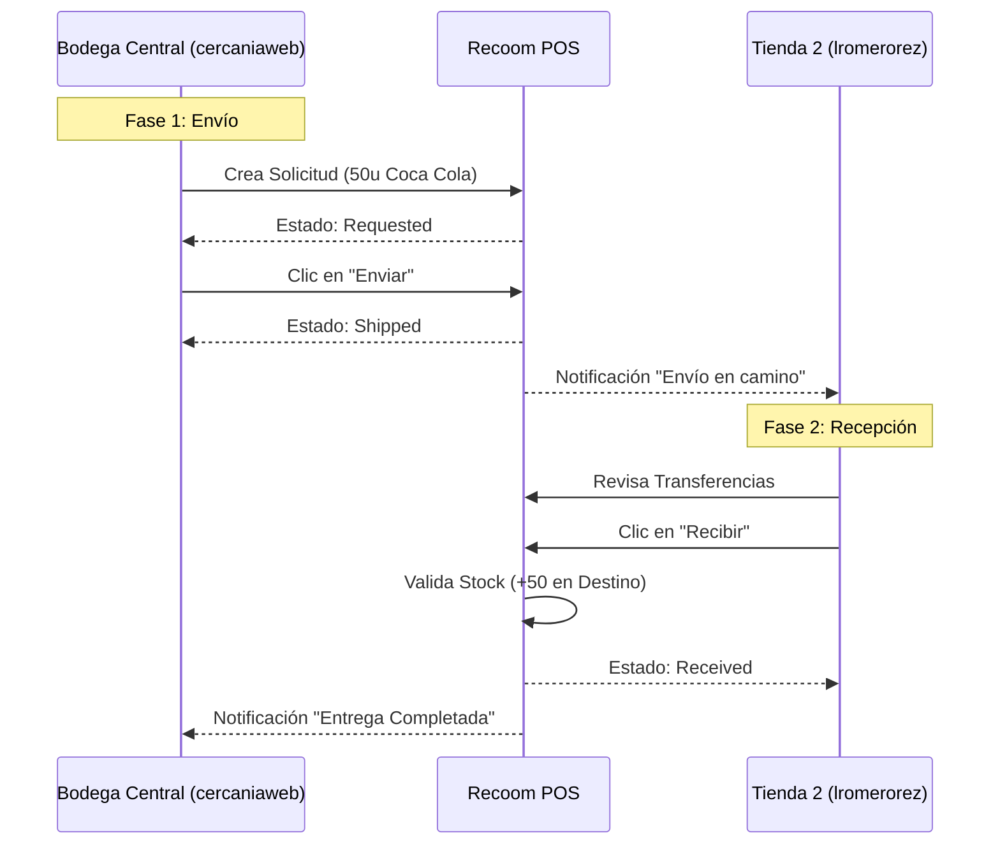

# 📖 Guía de Usuario - Recoom POS

Esta guía te enseñará a usar todas las funcionalidades de Recoom POS, desde el inicio de sesión hasta la gestión avanzada de inventario con voz.

---

## 🔐 1. Inicio de Sesión

Para acceder a la aplicación, ingresa tu correo electrónico y contraseña en la pantalla de login.

> [!TIP]
> La aplicación recordará tu sesión, así que no tendrás que iniciar sesión cada vez que la abras.

---

## 🏠 2. Dashboard Principal

Al iniciar sesión, llegarás al **Dashboard**, tu centro de comando con métricas clave: ventas del día, productos con inventario bajo, y accesos directos a todas las secciones.

La barra lateral izquierda te da acceso a todos los módulos:
- **Punto de Venta**: Para realizar ventas rápidas.
- **Inventario**: Gestión de stock.
- **Asistente de Voz**: Registro de productos con voz.
- **Productos, Categorías, Reportes, Usuarios, Configuración**.

---

## 🛒 3. Punto de Venta (POS)

El módulo POS está diseñado para **vender rápido**. Selecciona productos de la lista o busca por nombre/código de barras.

### Vista Inicial (Sin Productos en Carrito)

### Añadiendo Productos al Carrito
Haz clic en un producto para agregarlo. Puedes ajustar la cantidad directamente en el carrito.

### Finalizando la Venta
Al presionar **Cobrar**, se abrirá un modal de pago. Confirma el monto y método de pago para generar el recibo.

---

## 📦 4. Gestión de Productos

Desde la sección **Productos**, puedes ver, editar, y agregar nuevos artículos a tu catálogo.

> [!IMPORTANT]
> Los productos con stock bajo se resaltarán para facilitar su identificación.

---

## 🎤 5. Asistente de Inventario por Voz

El **Asistente de Voz** te permite registrar productos **manos libres**. Usa la función **Push to Talk** (mantén presionado para hablar).

### Cómo Usarlo:
1. Presiona **Iniciar**.
2. Mantén presionado el botón de micrófono mientras dictas (nombre, precio, stock, etc.).
3. Suelta el botón para que el sistema procese tu voz.
4. Confirma el producto y se guardará automáticamente.

---

## 🤖 6. Asistente de IA (Chatbot)

El chatbot de IA te ayuda a obtener información de tu negocio rápidamente. Pregunta cosas como "¿Cuál es mi producto más vendido?" o "¿Qué debo reabastecer?".

---

## 📊 7. Reabastecimiento Inteligente

La sección de **Reordenamiento Inteligente** usa IA para sugerirte qué productos necesitas comprar basándose en tus ventas históricas.

---

## 📅 8. Agendar Visitas de Proveedores

Desde el módulo de inventario, puedes agendar visitas con tus proveedores para no olvidar cuándo pasarán a surtir.

---

## ✅ Resumen de Módulos

| Módulo | Descripción |
|--------|-------------|
| POS | Realiza ventas rápidas con búsqueda y carrito intuitivo. |
| Inventario | Gestiona stock, ve alertas de bajo inventario. |
| Asistente de Voz | Registra productos dictando, sin teclear. |
| Chatbot IA | Pregunta sobre tu negocio y obtén respuestas instantáneas. |
| Productos | Edita tu catálogo de productos. |
| Reportes | Analiza tus ventas y rendimiento. |
| Configuración | Personaliza tu tienda y usuarios. |

---

> [!NOTE]
> Esta guía fue generada automáticamente como parte del proceso de testing de la aplicación Recoom POS.

---

## 🚚 9. Gestión de Transferencias (Flujo Completo 0-100)

Esta sección detalla el proceso completo de realizar una transferencia de inventario entre dos sucursales, utilizando dos cuentas de usuario para simular la operación real.

### Actores del Proceso
1.  **Tienda Origen (Solicitante)**: `cercaniaweb@gmail.com` (Ubicación: Bodega Central)
2.  **Tienda Destino (Receptor)**: `lromerorez@gmail.com` (Ubicación: Tienda 2)

### 🛠️ Fase 0: Configuración Previa

Antes de iniciar, aseguramos que el segundo usuario esté correctamente asignado a su tienda.

1.  Iniciar sesión con **Administrador** (`cercaniaweb@gmail.com`).
2.  Ir a **Usuarios** (`/users`).
3.  Verificar si `lromerorez@gmail.com` existe. Si no, hacer clic en "Añadir Usuario".
4.  **Crucial**: Asignar a `lromerorez@gmail.com` la tienda **"Tienda 2"** (o destino).
    *   *Nota: Si el usuario ya existe pero no tiene tienda, editarlo y asignarla.*

### 🚀 Fase 1: Creación de Solicitud (Origen)

**Usuario**: `cercaniaweb@gmail.com`

1.  Navegar a **Inventario > Transferencias** (`/inventory/transferencias`).
2.  En la sección "New Request":
    *   **Destination Store**: Seleccionar "Tienda 2" (donde está `lromerorez`).
    *   **Product**: Buscar "Coca Cola 600ml" (o cualquier producto con stock).
    *   **Quantity**: Ingresar `50`.
    *   Clic en **Add**.
3.  Revisar la lista de items y hacer clic en **Create Request**.

> **Estado del Sistema**: La transferencia se crea con estado `requested` (Solicitado).

4.  En "Transfer History", localizar la nueva transferencia.
5.  Hacer clic en el botón azul **Enviar** (Icono de camión 🚚).

> **Estado del Sistema**: La transferencia cambia a `shipped` (En Tránsito). El stock se descuenta temporalmente de la Bodega Central.

### 📥 Fase 2: Recepción de Mercancía (Destino)

**Usuario**: `lromerorez@gmail.com`

1.  Cerrar sesión de admin e iniciar con `lromerorez@gmail.com`.
2.  Observarás una notificación (campana) indicando "Transferencia Entrante".
3.  Navegar a **Inventario > Transferencias**.
4.  En "Transfer History", verás la transferencia marcada como **En Tránsito** (Azul).
5.  Como tienda destino, verás habilitado el botón verde **Recibir** (Icono de caja 📦).
6.  Hacer clic en **Recibir**.
    *   Se abrirá un modal para verificar la mercancía.
    *   Confirmar que llegaron las 50 unidades.
7.  Clic en **Confirmar Recepción**.

> **Estado del Sistema**: La transferencia cambia a `received` (Recibido). El stock de "Coca Cola 600ml" aumenta en +50 en la Tienda 2.

### ✅ Resumen Visual del Flujo

> [!TIP]
> **Manejo de Errores**: Si la Tienda 2 reporta mercancía dañada, no completes la recepción. Usa el botón "Reportar Incidencia" (funcionalidad futura) o ajusta la cantidad recibida en el modal antes de confirmar.

---

## 🌎 10. Catálogo Global (Modo Administrador)

Esta funcionalidad permite a los administradores crear productos centralizados y distribuirlos a las sucursales.

### Pasos para crear un Producto Global:

1.  Navegar a **Configuración > Catálogo Global** (o `/admin/catalog`).
2.  Hacer clic en el botón azul **"Nuevo Producto Global"**.
3.  Llenar los datos clave:
    *   **Nombre**, **Precio**, **Costo** y **SKU**.
    *   **Stock Inicial**: Al ingresar una cantidad mayor a 0, aparecerá un selector especial.
    *   **Tienda Destino**: Selecciona a qué sucursal se enviará este stock inicial (ej. "Tienda 2" o "Bodega Central").
4.  **Generación de Imagen**:
    *   Ubica la sección "Imagen del Producto".
    *   Haz clic en **"✨ Auto-generar Imagen"**.
    *   El sistema asignará automáticamente una imagen representativa para el producto.
5.  Clic en **"Crear Producto"**.

> **Resultado**: El producto se crea en la base de datos central y el stock especificado se suma directamente al inventario de la tienda seleccionada, listo para venderse.
